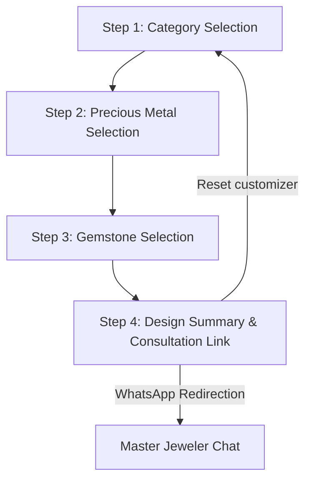

# Ochi Jewelry — Bespoke Customizer Specifications & Guidelines

This document details the visual styling, responsive layouts, CSS patterns, and integration specifications for the **Bespoke Jewelry Customizer** component implemented at [collections.html](file:///f:/ai-projects/ochijewelry/ochi-jewelry/src/app/pages/collections/collections.html), [collections.scss](file:///f:/ai-projects/ochijewelry/ochi-jewelry/src/app/pages/collections/collections.scss), and [collections.ts](file:///f:/ai-projects/ochijewelry/ochi-jewelry/src/app/pages/collections/collections.ts).

---

## 1. Structural Overview & Layouts

The customizer is built as a single-page interactive wizard housed inside a custom section.



### 1.1 Section Container (`.customizer-section`)
*   **Background:** Obsidian Dark (`var(--color-dark)` / `#111111`).
*   **Visual Highlights:** Contains a subtle, non-blocking gold radial glow behind the wizard card to highlight the custom design module:
    ```scss
    &::before {
      content: '';
      position: absolute;
      top: 50%;
      left: 50%;
      transform: translate(-50%, -50%);
      width: 600px;
      height: 600px;
      background: radial-gradient(circle, rgba(201, 168, 76, 0.05) 0%, transparent 70%);
      pointer-events: none;
      z-index: 1;
    }
    ```

### 1.2 Translucent Wrapper Card (`.customizer-inner`)
*   **Aesthetics:** Extended glassmorphism card (`.glass-card`).
*   **Dimensions:** Max-width of `900px` (centered).
*   **Padding:**
    *   **Desktop:** `var(--spacing-xl)` (64px) top/bottom, `var(--spacing-lg)` (40px) left/right.
    *   **Mobile (<768px):** `var(--spacing-lg)` (40px) top/bottom, `var(--spacing-sm)` (16px) left/right.

---

## 2. Header & Progress Indicators

### 2.1 Section Headings (`.customizer-header`)
*   **Label:** Gold uppercase text with `0.25em` spacing (`✦ BESPOKE CUSTOMIZER ✦`).
*   **Title (`h2`):** Primary display serif typeface (`var(--font-display)`), font size `clamp(2rem, 4vw, 3rem)`.
*   **Sub-paragraph (`p`):** Muted alabaster text (`var(--color-text-muted)`), max-width of `580px` for optimal reading length.

### 2.2 Progress Bar (`.progress-container`)
*   **Label (`.progress-text`):** Active step text (`Step X of 4`), uppercase, size `0.75rem`, letter spacing `0.08em`, gold.
*   **Track (`.progress-bar`):** Full-width, height `4px`, background `rgba(255, 255, 255, 0.07)`, rounded pill corners (`var(--radius-pill)`).
*   **Fill (`.progress-fill`):** Dynamic width bound to active step signal `(step * 25%)`. Features a premium left-to-right gold gradient (`var(--color-gold-dark)` to `var(--color-gold-light)`) with a smooth width transition (`0.35s ease`).

---

## 3. Interactive Step Grids

All options are displayed in grid structures. Active selections trigger automatic progress transitions to the next step.

### 3.1 Step 1: Categories Grid (`.categories-grid`)
*   **Desktop Layout:** `repeat(4, 1fr)` (4 columns).
*   **Tablet Layout (<768px):** `repeat(3, 1fr)`.
*   **Mobile Layout (<480px):** `repeat(2, 1fr)`.

### 3.2 Step 2 & 3: Metals & Gemstones Grids (`.metals-grid`, `.stones-grid`)
*   **Desktop Layout:** `repeat(5, 1fr)` (5 columns).
*   **Tablet Layout (<768px):** `repeat(3, 1fr)`.
*   **Mobile Layout (<480px):** `repeat(2, 1fr)`.

### 3.3 Option Buttons (`.option-btn`)
Buttons act as card elements for interactive selections:
*   **Aesthetics:** Glassmorphism surface, centering contents vertically and horizontally. Minimum height `140px`.
*   **Icons (`.opt-icon`):** Size `2.2rem`, transitions on hover (`transform 0.35s ease` scale and tilt).
*   **Labels (`.opt-label`):** Clean body font (`var(--font-body)`), size `0.85rem`, medium weight (`500`), white text.
*   **Hover/Focus State:** Lift transition (`translateY(-3px)`), background opacity boost to `8%`, gold borders, and glowing drop shadow.

---

## 4. Metal Gradient Swatches (`.metal-swatch`)

Metals feature circular swatches with realistic radial light reflections instead of flat solid colors:

| Metal Key | Display Name | Radial Gradient Code |
| :--- | :--- | :--- |
| `gold_18k` | 18K Yellow Gold | `radial-gradient(circle at 30% 30%, #FFE885 0%, #C9A84C 70%, #85641B 100%)` |
| `white_gold` | 18K White Gold | `radial-gradient(circle at 30% 30%, #FFFFFF 0%, #E4E4E7 50%, #A1A1AA 100%)` |
| `rose_gold` | 18K Rose Gold | `radial-gradient(circle at 30% 30%, #FFD1C1 0%, #E0A08D 75%, #A76B5A 100%)` |
| `platinum` | Premium Platinum | `radial-gradient(circle at 30% 30%, #FAFAFA 0%, #E0E7FF 35%, #9CA3AF 80%, #4B5563 100%)` |
| `silver` | Sterling Silver .925 | `radial-gradient(circle at 30% 30%, #F9FAFB 0%, #E5E7EB 60%, #9CA3AF 100%)` |

*   **Size:** `48px` x `48px` circular container (`border-radius: 50%`).
*   **Borders:** `2px solid rgba(255, 255, 255, 0.15)`.
*   **Shadows:** Inner shade `inset 0 2px 4px rgba(0,0,0,0.4)` combined with outer glow `0 2px 8px rgba(0,0,0,0.3)`.
*   **Interactive State:** Scaling up (`scale(1.1)`) and gold border outline changes on parent button hover.

---

## 5. Review & Consultation Page (Step 4)

### 5.1 Custom Recipe Summary Box (`.recipe-box`)
*   **Dimensions:** Max-width `480px` centered, padding `var(--spacing-md) var(--spacing-lg)`.
*   **Aesthetics:** Low-opacity glass panel (`rgba(255, 255, 255, 0.02)`).
*   **Details Items (`.recipe-item`):**
    *   Flex-aligned space-between rows.
    *   **Label column:** Size `0.75rem`, muted text, uppercase letter spacing.
    *   **Value column:** Cormorant Garamond display serif, size `1.15rem`, primary gold text (`var(--color-gold)`), weight `400`.
    *   **Mobile responsiveness (<480px):** Columns stack vertically to avoid overflow, labels left-align and values right-align.

### 5.2 Summary Actions (`.summary-actions`)
*   **Buttons:** Side-by-side flex layout (Desktop). Stacks vertically on screen widths `<580px>` with full-width buttons.
*   **Redirection Link (`.customizer-submit`):** Compiles selection keys, maps them to dynamic languages (Spanish/English), builds a URI-encoded string, and redirects to a dedicated WhatsApp API link (`https://wa.me/{{ 'contact.info.whatsapp_phone' | translate }}?text=...`) in a new tab.

---

## 6. Micro-Animations

*   `.animate-fade`: Applied to step elements dynamically rendered via Angular's `@if` structural block.
*   **Animation Details:**
    ```scss
    @keyframes fadeInUp {
      from { opacity: 0; transform: translateY(30px); }
      to   { opacity: 1; transform: translateY(0); }
    }
    .animate-fade {
      animation: fadeInUp 0.4s ease both;
    }
    ```
